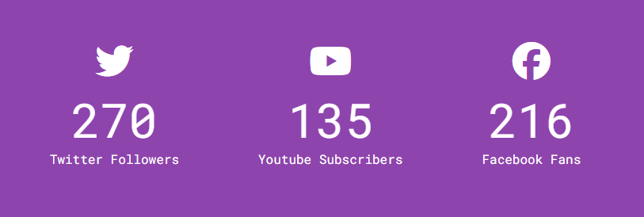

# Increment Counter

A simple increment counter for social media followers. The counters animate from 0 to the target number specified in the HTML.

## Preview

## How to Use ?

Open the index.html file in your web browser or simply checkout the deployed website [here](https://amit712singhal.github.io/Increment-Counter/).

## Features

- Animated counters for different social media platforms
- Uses Font Awesome icons for social media logos

## Credits

This project was created as part of a [50 Projects in 50 Days Course](https://www.udemy.com/course/50-projects-50-days/) on Udemy. Credits go to Brad Traversy & Florin Pop for providing guidance and resources.

## License

This project is licensed under the MIT License. See the [LICENSE](./LICENSE) file for more information.
